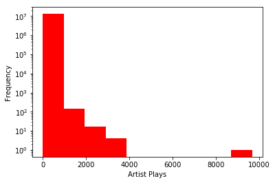
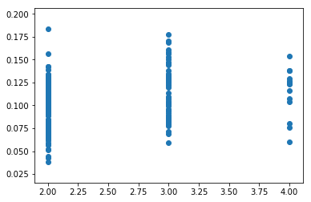
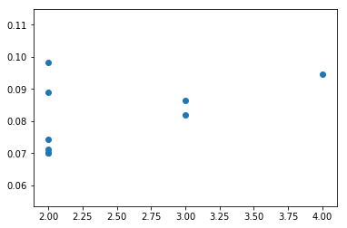
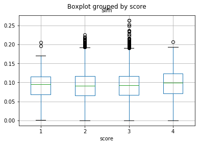

# Who would you listen to?: A Frequent Itemset Mining and Recommender System approach on the Million Song Dataset


```python
import pandas as pd
import random
import sqlite3
```

## Reading the files


```python
# Pandas
df_train = pd.read_csv('/mnt/data/public/millionsong/taste/train_triplets.txt',
                 delimiter='\t', usecols=[0, 1, 2],
                    names=['user_id', 'song_id', 'play_count'], index_col='song_id')
```


```python
#Connecting to tracks_metadata.db for other information
conn = sqlite3.connect('/mnt/data/public/millionsong/AdditionalFiles/track_metadata.db')
c = conn.cursor()
```


```python
tracks_db = pd.read_sql('''Select * from songs''', conn).set_index('song_id')
```


```python
orig_table = pd.merge(df_train, tracks_db[['artist_id']], left_index=True, right_index=True, how='left')
```

## EDA


```python
filtered = orig_table_a[orig_table_a['play_count']>1]
filtered = filtered.groupby(['user_id','artist_id'])['play_count'].sum()
```


```python
fig, ax  = plt.subplots()
ax.set_yscale('log')
ax.hist(filtered, color='red')
ax.set_xlabel("Artist Plays")
ax.set_ylabel("Frequency")
```


    Text(0, 0.5, 'Frequency')





```python
orig_table.reset_index(drop=True, inplace=True)
```


```python
orig_table = orig_table[orig_table['play_count']>1]
```


```python
orig_table = orig_table.groupby(['user_id', 'artist_id'])['play_count'].sum()
```


```python
orig_table = orig_table.reset_index()
```


```python
orig_table.head()
```


<div>
<table border="1" class="dataframe">
  <thead>
    <tr style="text-align: right;">
      <th></th>
      <th>user_id</th>
      <th>artist_id</th>
      <th>play_count</th>
    </tr>
  </thead>
  <tbody>
    <tr>
      <td>0</td>
      <td>00000b722001882066dff9d2da8a775658053ea0</td>
      <td>ARC07PP1187B9B49E9</td>
      <td>2</td>
    </tr>
    <tr>
      <td>1</td>
      <td>00001638d6189236866af9bbf309ae6c2347ffdc</td>
      <td>AR2DGPY1187FB4CECF</td>
      <td>2</td>
    </tr>
    <tr>
      <td>2</td>
      <td>00001638d6189236866af9bbf309ae6c2347ffdc</td>
      <td>AR5JPWN1187FB5B6DE</td>
      <td>2</td>
    </tr>
    <tr>
      <td>3</td>
      <td>00001638d6189236866af9bbf309ae6c2347ffdc</td>
      <td>AR9HFVQ1187FB4CF6B</td>
      <td>31</td>
    </tr>
    <tr>
      <td>4</td>
      <td>00001638d6189236866af9bbf309ae6c2347ffdc</td>
      <td>ARHUDAN1187B99251C</td>
      <td>5</td>
    </tr>
  </tbody>
</table>
</div>


```python
orig_table['play_count'].describe()
```


    count    1.305552e+07
    mean     8.626683e+00
    std      1.730619e+01
    min      2.000000e+00
    25%      2.000000e+00
    50%      5.000000e+00
    75%      8.000000e+00
    max      9.667000e+03
    Name: play_count, dtype: float64


```python
orig_table['play_count'] = orig_table.play_count.apply(lambda x: 1 if x==2 else (2 if x<=4 else (3 if x<=8 else 4)))
```


```python
sampled_users = np.random.choice(orig_table['user_id'].unique(), 10000, False)
```


```python
sampled_table = orig_table[orig_table['user_id'].isin(sampled_users)]
```

## Train a recommender system for artists


```python
from surprise import (Reader, Dataset, KNNWithMeans, SVDpp)
from surprise.model_selection import train_test_split
from surprise.accuracy import rmse

# for k in range(2,1000,20):
knn = SVDpp()
reader = Reader(rating_scale=(1,4))
dataset = Dataset.load_from_df(sampled_table, reader)

trainset, testset = train_test_split(dataset, test_size=0.25)
predictions = knn.fit(trainset).test(testset)
rmse(predictions)
```

    RMSE: 1.1036


    1.1035538610400073


```python
sampled_table.head()
```


<div>
<table border="1" class="dataframe">
  <thead>
    <tr style="text-align: right;">
      <th></th>
      <th>user_id</th>
      <th>artist_id</th>
      <th>play_count</th>
    </tr>
  </thead>
  <tbody>
    <tr>
      <td>27768</td>
      <td>008cb410c22ad601c9b689bdaf66725b5a9107ed</td>
      <td>AR1UR7X1187FB50596</td>
      <td>2</td>
    </tr>
    <tr>
      <td>27769</td>
      <td>008cb410c22ad601c9b689bdaf66725b5a9107ed</td>
      <td>AR35ZOY1187B98C79D</td>
      <td>4</td>
    </tr>
    <tr>
      <td>27770</td>
      <td>008cb410c22ad601c9b689bdaf66725b5a9107ed</td>
      <td>AR45CGR1187FB3BCC5</td>
      <td>1</td>
    </tr>
    <tr>
      <td>27771</td>
      <td>008cb410c22ad601c9b689bdaf66725b5a9107ed</td>
      <td>AR5MX2X1187FB3874F</td>
      <td>1</td>
    </tr>
    <tr>
      <td>27772</td>
      <td>008cb410c22ad601c9b689bdaf66725b5a9107ed</td>
      <td>AR65K7A1187FB4DAA4</td>
      <td>1</td>
    </tr>
  </tbody>
</table>
</div>


```python
top10users = sampled_table['user_id'].value_counts()[:10]
```


```python
top10users
```


    a15075a926c1998d91940f118342ba8356efc7d4    345
    e5b1a35349132afe4f96dd6b39cdc4d94031eb1b    260
    1d6cbd66794057c2e41c72500a628ae9609cd7bd    195
    3f1037fb3a74f351cd61fff169a54896d2be06f9    144
    74007a0653e621614f4924840c3105363daab7b5    142
    19cf743325b4c048d1385bb00d2aa1c9d4f0dd68    138
    10a426c4c969a2854bf2271a1e2836a014d85f9f    132
    44e9fc0a19baae46454c4e42123ee2db628770cd    131
    954db6d4c27e4ddafc92373722cf324bfb5f93ea    127
    8639f738b6e581bf7f12a83e21443874a7b18f38    127
    Name: user_id, dtype: int64


```python
sampled_table
```


<div>
<table border="1" class="dataframe">
  <thead>
    <tr style="text-align: right;">
      <th></th>
      <th>user_id</th>
      <th>artist_id</th>
      <th>play_count</th>
    </tr>
  </thead>
  <tbody>
    <tr>
      <td>27768</td>
      <td>008cb410c22ad601c9b689bdaf66725b5a9107ed</td>
      <td>AR1UR7X1187FB50596</td>
      <td>2</td>
    </tr>
    <tr>
      <td>27769</td>
      <td>008cb410c22ad601c9b689bdaf66725b5a9107ed</td>
      <td>AR35ZOY1187B98C79D</td>
      <td>4</td>
    </tr>
    <tr>
      <td>27770</td>
      <td>008cb410c22ad601c9b689bdaf66725b5a9107ed</td>
      <td>AR45CGR1187FB3BCC5</td>
      <td>1</td>
    </tr>
    <tr>
      <td>27771</td>
      <td>008cb410c22ad601c9b689bdaf66725b5a9107ed</td>
      <td>AR5MX2X1187FB3874F</td>
      <td>1</td>
    </tr>
    <tr>
      <td>27772</td>
      <td>008cb410c22ad601c9b689bdaf66725b5a9107ed</td>
      <td>AR65K7A1187FB4DAA4</td>
      <td>1</td>
    </tr>
    <tr>
      <td>...</td>
      <td>...</td>
      <td>...</td>
      <td>...</td>
    </tr>
    <tr>
      <td>13044964</td>
      <td>ffcd64564aba2a1eed8cb0afcbc313903261d542</td>
      <td>ARVV61U1187FB4FC32</td>
      <td>2</td>
    </tr>
    <tr>
      <td>13044965</td>
      <td>ffcd64564aba2a1eed8cb0afcbc313903261d542</td>
      <td>ARVXU2X1187B9AE6D8</td>
      <td>2</td>
    </tr>
    <tr>
      <td>13044966</td>
      <td>ffcd64564aba2a1eed8cb0afcbc313903261d542</td>
      <td>ARXWEBP1187B99BF48</td>
      <td>4</td>
    </tr>
    <tr>
      <td>13044967</td>
      <td>ffcd64564aba2a1eed8cb0afcbc313903261d542</td>
      <td>ARYQES41187B9B960F</td>
      <td>3</td>
    </tr>
    <tr>
      <td>13044968</td>
      <td>ffcd64564aba2a1eed8cb0afcbc313903261d542</td>
      <td>ARZ6IGY1187B98EB94</td>
      <td>2</td>
    </tr>
  </tbody>
</table>
<p>13391 rows × 3 columns</p>
</div>


## Apply the trained model to artists that a user hasn't listened to


```python
one_user_existing = sampled_table[sampled_table['user_id']==sampled_table.iloc[0,0]]
```


```python
def missing_artists(user, rounded=True):
    untried_artists = sampled_table[~sampled_table['artist_id'].isin(
        sampled_table.loc[sampled_table['user_id']==user,
                          'artist_id'])]['artist_id'].unique()
    one_user_missing = pd.DataFrame(columns=one_user_existing.columns)
    for artist in untried_artists:
        one_user_missing = one_user_missing.append(pd.Series({'user_id':user,
                                   'artist_id':artist,
                                   'play_count':knn.predict(user, artist).est}),
                            ignore_index=True)
    if rounded:
        one_user_missing['play_count_round'] = one_user_missing['play_count'].round()
    return one_user_missing
```


```python
conn2 = sqlite3.connect('/mnt/data/public/millionsong/AdditionalFiles/artist_term.db')
c = conn2.cursor()
```


```python
artist_db = pd.read_sql('''SELECT * FROM artist_term''', conn2).set_index('artist_id')
```


```python
artist_db.head()
```


<div>
<table border="1" class="dataframe">
  <thead>
    <tr style="text-align: right;">
      <th></th>
      <th>term</th>
    </tr>
    <tr>
      <th>artist_id</th>
      <th></th>
    </tr>
  </thead>
  <tbody>
    <tr>
      <td>AR002UA1187B9A637D</td>
      <td>garage rock</td>
    </tr>
    <tr>
      <td>AR002UA1187B9A637D</td>
      <td>country rock</td>
    </tr>
    <tr>
      <td>AR002UA1187B9A637D</td>
      <td>free jazz</td>
    </tr>
    <tr>
      <td>AR002UA1187B9A637D</td>
      <td>oi</td>
    </tr>
    <tr>
      <td>AR002UA1187B9A637D</td>
      <td>space rock</td>
    </tr>
  </tbody>
</table>
</div>


## Get the similarity of artists in genre


```python
def get_dist(artist1, artist2):
    if artist1 in artist_db.index:
        genre1 = artist_db.loc[artist1]
    else:
        return 0

    if artist2 in artist_db.index:
        genre2 = artist_db.loc[artist2]
    else:
        return 0

    if type(genre1.term)!=str:
        gen1 = set(genre1.term.values)
    else:
        gen1 = {genre1.term}

    if type(genre2.term)!=str:
        gen2 = set(genre2.term.values)
    else:
        gen2 = {genre2.term}
    jac_sim = len(gen1.intersection(gen2)) / len(gen1.union(gen2))
#     print(len(gen1), len(gen2), len(gen1.intersection(gen2)), jac_sim)
    return jac_sim
```


```python
sampled_table[sampled_table['user_id'].isin(top10users.index)]
```


<div>
<table border="1" class="dataframe">
  <thead>
    <tr style="text-align: right;">
      <th></th>
      <th>user_id</th>
      <th>artist_id</th>
      <th>play_count</th>
    </tr>
  </thead>
  <tbody>
    <tr>
      <td>833509</td>
      <td>10a426c4c969a2854bf2271a1e2836a014d85f9f</td>
      <td>AR0A9UD1187B9AC521</td>
      <td>4</td>
    </tr>
    <tr>
      <td>833510</td>
      <td>10a426c4c969a2854bf2271a1e2836a014d85f9f</td>
      <td>AR0AJG11187FB51EFC</td>
      <td>2</td>
    </tr>
    <tr>
      <td>833511</td>
      <td>10a426c4c969a2854bf2271a1e2836a014d85f9f</td>
      <td>AR0L04E1187B9AE90C</td>
      <td>1</td>
    </tr>
    <tr>
      <td>833512</td>
      <td>10a426c4c969a2854bf2271a1e2836a014d85f9f</td>
      <td>AR0XOGM1187B9B3754</td>
      <td>3</td>
    </tr>
    <tr>
      <td>833513</td>
      <td>10a426c4c969a2854bf2271a1e2836a014d85f9f</td>
      <td>AR190KO1187B9905EC</td>
      <td>3</td>
    </tr>
    <tr>
      <td>...</td>
      <td>...</td>
      <td>...</td>
      <td>...</td>
    </tr>
    <tr>
      <td>11709438</td>
      <td>e5b1a35349132afe4f96dd6b39cdc4d94031eb1b</td>
      <td>ARYW3V11187B99C8C9</td>
      <td>1</td>
    </tr>
    <tr>
      <td>11709439</td>
      <td>e5b1a35349132afe4f96dd6b39cdc4d94031eb1b</td>
      <td>ARZ3TJ01187B989C6E</td>
      <td>3</td>
    </tr>
    <tr>
      <td>11709440</td>
      <td>e5b1a35349132afe4f96dd6b39cdc4d94031eb1b</td>
      <td>ARZENOX1187B98A645</td>
      <td>4</td>
    </tr>
    <tr>
      <td>11709441</td>
      <td>e5b1a35349132afe4f96dd6b39cdc4d94031eb1b</td>
      <td>ARZQ1KI1187FB4E578</td>
      <td>1</td>
    </tr>
    <tr>
      <td>11709442</td>
      <td>e5b1a35349132afe4f96dd6b39cdc4d94031eb1b</td>
      <td>ARZZ5ZR1187FB4D149</td>
      <td>4</td>
    </tr>
  </tbody>
</table>
<p>1741 rows × 3 columns</p>
</div>


```python
genre_dist = pd.DataFrame(columns=['user_id', 'artist_id', 'sim', 'score'])

for user in top10users.index:
# for user in random.sample(sampled_table['user_id'].unique().tolist(), 10):
    one_user_existing = sampled_table[sampled_table['user_id']==user]
    one_user_missing = missing_artists(user)
    for i in range(1, 5):
        rating_missing_i = one_user_missing[one_user_missing['play_count_round']==i]
        rating_existing_i = one_user_existing[one_user_existing['play_count']==i]
        for artist in rating_missing_i['artist_id']:
            sim = rating_existing_i['artist_id'].apply(lambda x: get_dist(x, artist)).mean()
#             print(sim)
            genre_dist = genre_dist.append(pd.Series({'user_id':user,
                                   'artist_id':artist,
                                   'sim':sim,
                                   'score':i,
                                   'score_unrounded':knn.predict(user, artist).est}),
                            ignore_index=True)
#     print(user)
    genre_dist.to_pickle('sim_vs_score_artist_recom_to_a_user2.pickle')
#             break
#         break
#     break
```


```python
genre_dist2 = pd.DataFrame(columns=['user_id', 'artist_id', 'sim', 'score'])

for user in top10users.index:
# for user in random.sample(sampled_table['user_id'].unique().tolist(), 10):
    one_user_existing = sampled_table[sampled_table['user_id']==user]
    one_user_missing = missing_artists(user)
    for i in range(1, 5):
        rating_missing_i = one_user_missing[one_user_missing['play_count_round']==i]
        rating_existing_i = one_user_existing[one_user_existing['play_count']==i]
        for artist in rating_missing_i['artist_id']:
            sim = rating_existing_i['artist_id'].apply(lambda x: get_dist(x, artist)).mean()
#             print(user, artist)
            genre_dist2 = genre_dist.append(pd.Series({'user_id':user,
                                   'artist_id':artist,
                                   'sim':sim,
                                   'score':i,
                                    'score_unrounded':knn.predict(user, artist).est}),
                            ignore_index=True)
#     print(user)
    genre_dist.to_pickle('sim_vs_score_artist_recom_to_a_user.pickle')
#             break
#         break
#     break
```


```python
genre_dist = pd.read_pickle('sim_vs_score_artist_recom_to_a_user.pickle')
```

## Genre similarity vs recommendation
We want to check whether the recommendation is solely based on the artists being on the same genre or not.


```python
genre_dist_garage = genre_dist[genre_dist['artist_id'].isin(artist_db[artist_db['term']=='piano blues'].index)]
plt.scatter(genre_dist_garage['score'], genre_dist_garage['sim'])
```


    <matplotlib.collections.PathCollection at 0x7f8a323aa198>





The lack of a trend implies that the recommendation is not affected much by genre.

## Genre EDA


```python
terms = artist_db.reset_index().groupby('term').count()
terms = terms[terms['artist_id']>25]
```


```python
# term_r2 = artist_db[artist_db.reset_index().groupby('term').count() > 25].index
for term in terms.index:
    genre_dist_garage = genre_dist[genre_dist['artist_id'].isin(artist_db[artist_db['term']==term].index)]
    genre_dist_garage['score'] = genre_dist_garage['score'].astype(float)
    terms.loc[term, 'r2'] = genre_dist_garage[['sim', 'score']].corr().iloc[0, 1]
#     print(term, genre_dist_garage[['sim', 'score']].corr().iloc[0, 1])
```


```python
terms.sort_values('r2', ascending=False).head(20).rename(columns={'artist_id':'count'})
```


<div>
<table border="1" class="dataframe">
  <thead>
    <tr style="text-align: right;">
      <th></th>
      <th>count</th>
      <th>r2</th>
    </tr>
    <tr>
      <th>term</th>
      <th></th>
      <th></th>
    </tr>
  </thead>
  <tbody>
    <tr>
      <td>gramophone</td>
      <td>27</td>
      <td>0.875906</td>
    </tr>
    <tr>
      <td>music chain</td>
      <td>30</td>
      <td>0.823022</td>
    </tr>
    <tr>
      <td>fingerstyle</td>
      <td>49</td>
      <td>0.664757</td>
    </tr>
    <tr>
      <td>gramusels bluesrock</td>
      <td>53</td>
      <td>0.621124</td>
    </tr>
    <tr>
      <td>southern metal</td>
      <td>32</td>
      <td>0.619500</td>
    </tr>
    <tr>
      <td>wop</td>
      <td>47</td>
      <td>0.599548</td>
    </tr>
    <tr>
      <td>blackened thrash metal</td>
      <td>31</td>
      <td>0.583349</td>
    </tr>
    <tr>
      <td>barturismooth</td>
      <td>35</td>
      <td>0.562917</td>
    </tr>
    <tr>
      <td>country divas</td>
      <td>30</td>
      <td>0.522163</td>
    </tr>
    <tr>
      <td>musette</td>
      <td>58</td>
      <td>0.517341</td>
    </tr>
    <tr>
      <td>slide guitar</td>
      <td>60</td>
      <td>0.515201</td>
    </tr>
    <tr>
      <td>jewish</td>
      <td>91</td>
      <td>0.511151</td>
    </tr>
    <tr>
      <td>nashville sound</td>
      <td>32</td>
      <td>0.496138</td>
    </tr>
    <tr>
      <td>teppaz</td>
      <td>39</td>
      <td>0.487583</td>
    </tr>
    <tr>
      <td>gothic punk</td>
      <td>31</td>
      <td>0.484353</td>
    </tr>
    <tr>
      <td>middle east</td>
      <td>76</td>
      <td>0.480955</td>
    </tr>
    <tr>
      <td>surreal</td>
      <td>30</td>
      <td>0.477417</td>
    </tr>
    <tr>
      <td>jug band</td>
      <td>52</td>
      <td>0.463081</td>
    </tr>
    <tr>
      <td>west coast blues</td>
      <td>32</td>
      <td>0.453020</td>
    </tr>
    <tr>
      <td>swamp blues</td>
      <td>31</td>
      <td>0.444967</td>
    </tr>
  </tbody>
</table>
</div>


```python
genre_dist_garage = genre_dist[genre_dist['artist_id'].isin(artist_db[artist_db['term']=='middle east'].index)]
plt.scatter(genre_dist_garage['score'], genre_dist_garage['sim'])
```


    <matplotlib.collections.PathCollection at 0x7f89a19aba58>





```python
%matplotlib inline
import matplotlib.pyplot as plt

# plt.scatter(genre_dist['sim'], genre_dist['score'])
genre_dist.boxplot(column='sim',by='score')
```


    <matplotlib.axes._subplots.AxesSubplot at 0x7f21fad0fdd8>





```python
artist_dict = tracks_db[['artist_id','artist_name']].set_index('artist_id').iloc[:, 0].to_dict()
```


```python
one_user['artist_name'] = one_user.apply(lambda x: artist_dict[x.artist_id], axis=1)
```


```python
one_user.sort_values('play_count', ascending=False)
```


<div>
<table border="1" class="dataframe">
  <thead>
    <tr style="text-align: right;">
      <th></th>
      <th>user_id</th>
      <th>artist_id</th>
      <th>play_count</th>
      <th>artist_name</th>
    </tr>
  </thead>
  <tbody>
    <tr>
      <td>6</td>
      <td>0049dafc81298728192fd26feddb8c199f693841</td>
      <td>ARAXU5Z1187B98FECD</td>
      <td>4.0</td>
      <td>Gorillaz</td>
    </tr>
    <tr>
      <td>22</td>
      <td>0049dafc81298728192fd26feddb8c199f693841</td>
      <td>ART50HO1187FB4D0ED</td>
      <td>4.0</td>
      <td>Abba</td>
    </tr>
    <tr>
      <td>0</td>
      <td>0049dafc81298728192fd26feddb8c199f693841</td>
      <td>AR02YGA1187B9B8AC4</td>
      <td>3.0</td>
      <td>Bersuit Vergarabat</td>
    </tr>
    <tr>
      <td>14</td>
      <td>0049dafc81298728192fd26feddb8c199f693841</td>
      <td>ARIUA0B1187B9A08D5</td>
      <td>3.0</td>
      <td>Chambao</td>
    </tr>
    <tr>
      <td>5</td>
      <td>0049dafc81298728192fd26feddb8c199f693841</td>
      <td>AR8SRQ31187FB4D477</td>
      <td>3.0</td>
      <td>Ten Years After</td>
    </tr>
    <tr>
      <td>...</td>
      <td>...</td>
      <td>...</td>
      <td>...</td>
      <td>...</td>
    </tr>
    <tr>
      <td>23</td>
      <td>0049dafc81298728192fd26feddb8c199f693841</td>
      <td>ARTW7I31187B9A4CA9</td>
      <td>1.0</td>
      <td>!!!</td>
    </tr>
    <tr>
      <td>7</td>
      <td>0049dafc81298728192fd26feddb8c199f693841</td>
      <td>ARBLDRW1187B9A05A1</td>
      <td>1.0</td>
      <td>The Kills</td>
    </tr>
    <tr>
      <td>4</td>
      <td>0049dafc81298728192fd26feddb8c199f693841</td>
      <td>AR5TZFO1187B98E58E</td>
      <td>1.0</td>
      <td>Jedi Mind Tricks</td>
    </tr>
    <tr>
      <td>24</td>
      <td>0049dafc81298728192fd26feddb8c199f693841</td>
      <td>ARXXACJ1187FB4BFD1</td>
      <td>1.0</td>
      <td>Trevor Hall</td>
    </tr>
    <tr>
      <td>12</td>
      <td>0049dafc81298728192fd26feddb8c199f693841</td>
      <td>ARGUAHS11F50C4CF7D</td>
      <td>1.0</td>
      <td>Los Traileros Del Norte</td>
    </tr>
  </tbody>
</table>
<p>4853 rows × 4 columns</p>
</div>


## FIM


```python
FIM_res = pd.read_pickle('ante_cons_FIM.pickle')
```


```python
FIM_res.head()
```


<div>
<table border="1" class="dataframe">
  <thead>
    <tr style="text-align: right;">
      <th></th>
      <th>consequents</th>
      <th>antecedents</th>
      <th>consequent support</th>
      <th>antecedent support</th>
      <th>support</th>
      <th>confidence</th>
      <th>lift</th>
    </tr>
  </thead>
  <tbody>
    <tr>
      <td>105</td>
      <td>Usher featuring will.i.am</td>
      <td>(Charttraxx Karaoke, Train, Harmonia)</td>
      <td>0.027139</td>
      <td>0.010056</td>
      <td>0.006134</td>
      <td>0.609974</td>
      <td>22.475518</td>
    </tr>
    <tr>
      <td>104</td>
      <td>Usher featuring will.i.am</td>
      <td>(Charttraxx Karaoke, Train, OneRepublic)</td>
      <td>0.027139</td>
      <td>0.010186</td>
      <td>0.006188</td>
      <td>0.607464</td>
      <td>22.383063</td>
    </tr>
    <tr>
      <td>78</td>
      <td>Charttraxx Karaoke</td>
      <td>(Train, Harmonia, Florence + The Machine)</td>
      <td>0.034798</td>
      <td>0.010719</td>
      <td>0.007487</td>
      <td>0.698488</td>
      <td>20.072768</td>
    </tr>
    <tr>
      <td>73</td>
      <td>Charttraxx Karaoke</td>
      <td>(Train, OneRepublic, Florence + The Machine)</td>
      <td>0.034798</td>
      <td>0.011098</td>
      <td>0.007687</td>
      <td>0.692626</td>
      <td>19.904293</td>
    </tr>
    <tr>
      <td>82</td>
      <td>Charttraxx Karaoke</td>
      <td>(Train, Harmonia, OneRepublic)</td>
      <td>0.034798</td>
      <td>0.011988</td>
      <td>0.008181</td>
      <td>0.682452</td>
      <td>19.611929</td>
    </tr>
  </tbody>
</table>
</div>


```python
artist_db
```


<div>
<table border="1" class="dataframe">
  <thead>
    <tr style="text-align: right;">
      <th></th>
      <th>term</th>
    </tr>
    <tr>
      <th>artist_id</th>
      <th></th>
    </tr>
  </thead>
  <tbody>
    <tr>
      <td>AR002UA1187B9A637D</td>
      <td>garage rock</td>
    </tr>
    <tr>
      <td>AR002UA1187B9A637D</td>
      <td>country rock</td>
    </tr>
    <tr>
      <td>AR002UA1187B9A637D</td>
      <td>free jazz</td>
    </tr>
    <tr>
      <td>AR002UA1187B9A637D</td>
      <td>oi</td>
    </tr>
    <tr>
      <td>AR002UA1187B9A637D</td>
      <td>space rock</td>
    </tr>
    <tr>
      <td>...</td>
      <td>...</td>
    </tr>
    <tr>
      <td>ARZZZKG1271F573BC4</td>
      <td>heavy</td>
    </tr>
    <tr>
      <td>ARZZZKG1271F573BC4</td>
      <td>dark</td>
    </tr>
    <tr>
      <td>ARZZZKG1271F573BC4</td>
      <td>instrumental</td>
    </tr>
    <tr>
      <td>ARZZZKG1271F573BC4</td>
      <td>beautiful</td>
    </tr>
    <tr>
      <td>ARZZZKG1271F573BC4</td>
      <td>guitar</td>
    </tr>
  </tbody>
</table>
<p>1109381 rows × 1 columns</p>
</div>


```python

```
